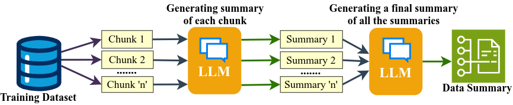
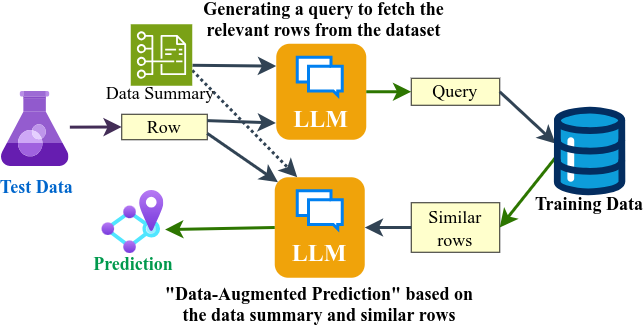

<!-- Copyright (c) 2024 Praneeth Vadlapati -->

#  LML & DAP

## Language Model Learning a Dataset for Data-Augmented Prediction

[](./LICENSE.md)
[](https://arxiv.org/abs/2409.18957)
[](https://www.python.org/)
<br> <br> <br>

#### Why LML & DAP?
- Classification tasks are typically handled using Machine Learning (ML) models, which lack a balance between accuracy and interpretability.
- This project introduces a new approach to using Large Language Models (LLMs) for classification tasks in an explainable way.
- Unlike ML models that rely heavily on data cleaning and feature engineering, this method streamlines the process using LLMs.

<!-- Demo image -->
LML: <br>

DAP: <br>



Created by Praneeth Vadlapati ([@prane-eth](https://github.com/prane-eth))

> [!NOTE]
> Please star :star: the repository to show your support. <br>

## :page_facing_up: Research Paper
A **preprint** of the research paper is available on [arXiv](https://arxiv.org/abs/2409.18957) <br>

## :bookmark_tabs: Citation
To use my paper for reference, please cite it as below:
```bibtex
@misc{vadlapati2024lml,
	title={{LML: Language Model Learning a Dataset for Data-Augmented Prediction}},
	author={{Praneeth Vadlapati}},
	year={2024},
	month={Sep},
	archivePrefix={arXiv},
	primaryClass={cs.CL},
	url={https://arxiv.org/abs/2409.18957}
}
```


## :rocket: Quick Start
```bash
pip install -r requirements.txt
cp .env.example .env
```
Now, edit the `.env` file and add your values. <br>
Run the file [Experiment-LML.ipynb](Experiment-LML.ipynb)


## :computer: More Projects
For more projects, open the profile: **[@Pro-GenAI](https://github.com/Pro-GenAI)** <br>


## :hammer_and_wrench: Contributing
Contributions are welcome! Feel free to create an issue for any bug reports or suggestions. <br>
To contribute, star :star: the repository and create an Issue. If I can't solve it, I will allow anyone to create a pull request.<br>


## :identification_card: License
Copyright (c) 2024 Praneeth Vadlapati <br>
Please refer to the [LICENSE](./LICENSE.md) file for more information.


## :warning: Disclaimer
The code is not intended for use in production environments.
This code is for educational and research purposes only.

No author is responsible for any misuse or damage caused by this code.
Use it at your own risk. The code is provided as is without any guarantees or warranty.

## :globe_with_meridians: Acknowledgements
- Special thanks to **Groq** (https://groq.com/) for a fast a inference of Llama 3.1


## :email: Contact
For personal queries, please find my contact details here: [linktr.ee/prane.eth](https://linktr.ee/prane.eth)

